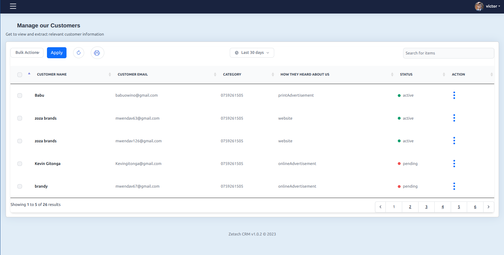

<p align="center">
  
</p>

# CustomeerCRM

Customeer is a powerful CRM (Customer Relationship Management) application built with Laravel. It provides a comprehensive solution for managing customer relationships and other related tasks.

## Table of Contents
- [Features](#features)
- [Requirements](#requirements)
- [Installation](#installation)
- [Environment variables](#environmentvariables)
- [Screenshots](#screenshots)
- [License](#license)

## Features

- User-friendly interface for managing customer data and interactions.
- Customer Contact management: Create, view, edit, and delete customer contacts.
- Inquiry management: Create, view, edit, and delete customer inquiries.
- Team performance tracking: Track performance of users easily.
- Reports and analytics: Generate insightful reports and visualize data.
- Customization: Adapt the CRM to your specific business needs.
- Role-based access control: Assign different user roles and permissions.

## Requirements

Before installing Customeer CRM, ensure that you have the following prerequisites:

- PHP 7.4 or higher
- Composer
- Laravel 8.x
- MySQL or another compatible database

## Installation

Follow the steps below to set up Customeer CRM:

1. Clone the repository:

   ```bash
   git clone https://github.com/vic-mwenda/Simple-School-CRM-Laravel
   ```
2. Navigate to the project directory:


3. Install the project dependencies using Composer:

```bash
Composer Install
```

4. Create a copy of the `.env.example` file and rename it to `.env`:
```bash
cp .env.example .env
```
5. Generate a unique application key:

```bash
php artisan key:generate
```


6. Update the `.env` file with your database credentials.

7. Create an empty database for Customeer CRM in your MySQL server. 

8.Import the database structure and sample data by running the following command:

```bash
mysql -u <username> -p <database_name> < path/to/backup.sql
```
Replace <username> with your MySQL username, <database_name> with the name of the database you created, and path/to/backup.sql with the path to the backup.sql file included in the project

9.Start the development server:

```bash
php artisan serve
```
10.Open your web browser and visit http://localhost:8000 to access Customeer CRM.


## Environment Variables

To run this project, you will need to add the following environment variables to your .env file

`VONAGE_KEY`

`VONAGE_SECRET`

`GOOGLE_CLIENT_ID`

`GOOGLE_CLIENT_SECRET`


## Screenshots


<p align='center'>
  
</p>

## License

[MIT](https://choosealicense.com/licenses/mit/)

